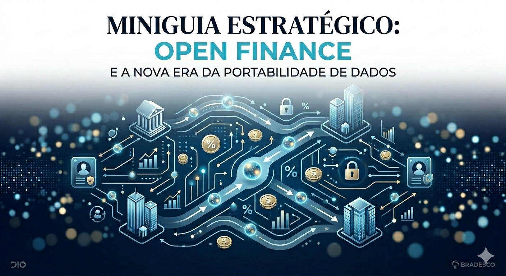

# 🏦 Miniguia Estratégico: Open Finance e a Nova Era da Portabilidade de Dados

---

## 👋 Bem-vindo(a) ao nosso Estúdio de Aprendizado Ativo!

Você sabia que agora é o verdadeiro dono dos seus dados bancários? Este espaço interativo foi criado para mostrar como o **Open Finance** coloca o controle do dinheiro nas suas mãos, de forma simples, prática e totalmente sem mistérios! 

Este projeto faz parte do desafio **DIO + Bradesco**, unindo curadoria de dados, pensamento crítico e inteligência artificial para descomplicar a evolução do sistema financeiro nacional.

---

## 🚀 Como explorar este projeto?

Este repositório está conectado a um ambiente dinâmico de estudos no **NotebookLM**. Lá dentro, você pode interagir diretamente com a IA para aprender ativamente:

*   **Acesse o Miniguia:** No painel lateral do estúdio, você encontra resumos rápidos e fáceis sobre o ecossistema.
*   **Explore o Glossário:** Ficou em dúvida sobre termos como *APIs* ou *Portabilidade*? O glossário rápido resolve isso para você.
*   **Use os Prompts Reutilizáveis:** Instruções prontas criadas com engenharia de prompts para guiar sua navegação.

---

## 💬 Desafie a Inteligência Artificial no Chat!

Quer ver a mágica acontecer? Clique no link do projeto abaixo e experimente copiar e colar uma destas perguntas no chat do estúdio:

1. 💡 *“Como o Open Finance me ajuda na prática a conseguir crédito ou cartões melhores?”*
2. 🔒 *“O compartilhamento dos meus dados bancários entre as instituições é realmente seguro?”*
3. 🔄 *“Qual é a real diferença entre o Pix e o ecossistema do Open Finance?”*

---

## 🔗 Acesse o Projeto Completo

Pronto(a) para ver o futuro do mercado financeiro trabalhar para você? 

👉 [**CLIQUE AQUI PARA ACESSAR O ESTÚDIO NO NOTEBOOKLM**](https://notebooklm.google.com/notebook/a59a6559-37c7-4b99-8e60-636e955c9ffc)

---
*Desenvolvido com orgulho por Ana Caroline Campos Santos como parte do bootcamp DIO + Bradesco.* 💻✨